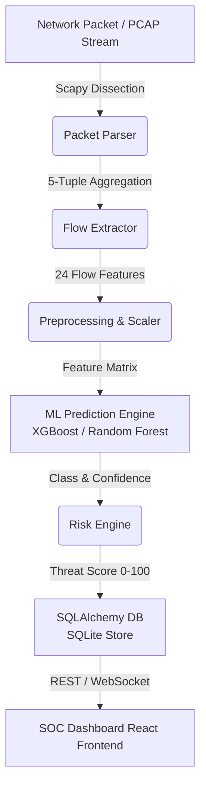

# AI-NIDS Architecture Documentation

The **AI-Powered Network Intrusion Detection System (AI-NIDS)** is designed as a modular, high-throughput defensive cybersecurity platform.

## System Architecture Diagram

## Modular Subsystems

1. **Network Analysis Module**: Parses raw `.pcap` and `.pcapng` header layers securely without payload execution.
2. **Flow Extractor**: Converts packet headers into bidirectional 5-tuple flow statistical feature vectors matching the CIC-IDS2017 schema.
3. **ML Prediction Engine**: Evaluates feature vectors against trained machine learning models (XGBoost, Random Forest, Logistic Regression).
4. **Transparent Risk Engine**: Combines model confidence with domain heuristics (packet rate, critical target ports, TCP flags) to output a 0–100 threat score and severity band (Normal, Low, Medium, High, Critical).
5. **Explainable AI (XAI)**: Provides human-readable detection indicators and feature attribution importances for every alert.
6. **FastAPI Backend & SQLite Store**: Exposes asynchronous REST endpoints, manages alert state triage, and streams live detections via WebSocket.
7. **React SOC Dashboard**: Modern cybersecurity dark-theme dashboard featuring interactive Recharts visualization.
